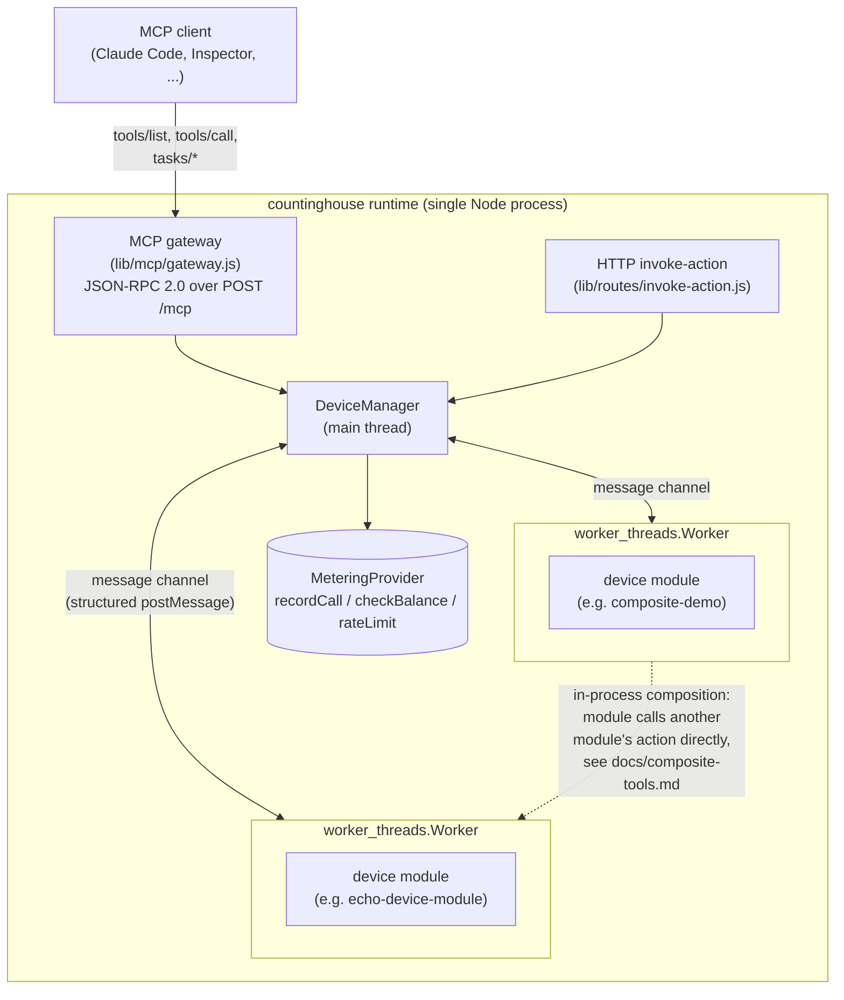

# countinghouse

**countinghouse hosts your MCP tools, meters every call, and lets tools
call each other in-process — so you can charge for what agents actually
use.**

It's a multi-tenant runtime for MCP: load Node.js "device modules" as
isolated tools, expose them over a stateless Streamable HTTP MCP gateway,
and get per-call metering, per-key rate limiting, and in-process tool
composition without hand-rolling any of it.

## 30-second quickstart

Requires Node.js >= 20, and a Redis instance reachable at
`redis://127.0.0.1:6379` (used for metering, rate limiting, and session
state — see `--redisUrl` to point elsewhere). **No other external
service is required** — authentication is file-backed by default (see
[Authentication](#authentication) below), not a database you have to
stand up first.

```sh
# don't have Redis running already? this is enough for local evaluation
docker run -d --name countinghouse-redis -p 6379:6379 redis:7
```

**Install from npm** — for running countinghouse as-is:

```sh
npm install countinghouse

# start the runtime, loading the bundled echo demo module.
# `countinghouse` (or the short alias `cth`) is on your PATH via npx.
npx countinghouse --workerThread --bindAddr 127.0.0.1 \
  --loadModule ./node_modules/countinghouse/pre-installed-packages/echo-device-module
# -> countinghouse listen on: 127.0.0.1:9527
```

**Install from source** — for developing on countinghouse itself, or running
the test suite:

```sh
git clone https://github.com/mchen6/countinghouse.git
cd countinghouse
npm install

# enable the repo's git hooks (git does not clone hooks). The pre-commit hook
# runs the golden tools/list check -- ~10s -- so no commit can move the MCP
# surface without saying so. CI enforces the same thing.
git config core.hooksPath .githooks

# from a clone the bundled modules are at the repo root, and framework.js is
# run directly rather than through the installed bin
node ./framework.js --workerThread --bindAddr 127.0.0.1 \
  --loadModule ./pre-installed-packages/echo-device-module
# -> countinghouse listen on: 127.0.0.1:9527
```

The two differ only in how the runtime is launched and where the bundled
demo modules live; every flag, endpoint and behaviour below is identical.
`auth.json` is created in the current working directory either way.

No `auth.json` yet? The first run generates one (at
`<repo-root>/auth.json` by default — see `--authConfigPath`) with a demo
API key and prints it once, right at startup:

```
============================================================
countinghouse: no /path/to/countinghouse/auth.json found.
Generated a demo API key with access to every device --
replace it before any real deployment:

  X-CH-Key: demo-a1b2c3d4e5f6...

Edit /path/to/countinghouse/auth.json to add real keys, or set
COUNTINGHOUSE_API_KEY for single-key mode instead.
============================================================
```

Point an MCP client at it, passing that key as a header:

```sh
claude mcp add --transport http countinghouse http://127.0.0.1:9527/mcp \
  --header "X-CH-Key: demo-a1b2c3d4e5f6..."
```

Then, in a Claude Code session, just ask it to call the tool — e.g.
"use the countinghouse echo tool to echo back 'hello'". `tools/list`
exposes one tool per device module action (`echo_device_echoservice_echo`
in this case), each with a JSON Schema 2020-12 `inputSchema`/`outputSchema`
derived straight from the module's own spec — and, since `tools/list` is
filtered per apiKey, only the tools for devices that key actually has
access to (the demo key has access to every device).

Want to see tool composition and per-hop billing in one call? See the
[Composite demo walkthrough](#composite-demo-walkthrough) below.

## Authentication

Every request carries an API key (`X-CH-Key` header for HTTP/MCP), and
`AuthProvider` decides which devices that key can see and call —
pluggable via `--authProvider file|sqlite|couchdb`. `file` (the default
shown above) needs nothing beyond a JSON file and is what the quickstart
uses; `sqlite` trades the hand-edited file for a real db once you have
more keys than are comfortable to manage by hand; `couchdb` is for
plugging into a CouchDB-backed deployment you already operate, and is the
only one of the three that needs an external service.

A second, independent capability, `admin`, gates the module-lifecycle
endpoints (`/load-module` and friends) — a key can have access to every
device and still not be admin, which is exactly what the auto-generated demo
key is. Set `"admin": true` on a key in `auth.json` to grant it. See
[Admin keys](https://github.com/mchen6/countinghouse/blob/master/docs/authentication.md#admin-keys).

**Normal use — including loading modules into a running server — does not
need `--debug`.** `--debug` (used by this repo's own test suite) bypasses
`AuthProvider` entirely: every apiKey is accepted, every key is treated as
admin, `tools/list` stops filtering, and task ownership stops being checked.
It's for local iteration, not for anything reachable beyond localhost, and
not the way to get access to an endpoint that returns `403 ADMIN_REQUIRED` —
grant `admin` instead.

**The auto-generated demo key shown above grants wildcard access to every
device with no expiry — replace it before any real deployment.** Full
reference, including `auth.json`'s format, admin keys, and CouchDB setup:
[`docs/authentication.md`](https://github.com/mchen6/countinghouse/blob/master/docs/authentication.md).

## Composite demo walkthrough

Beyond a single tool call, `composite-demo` shows one MCP `tools/call`
fanning out into two in-process, metered inner hops: it calls
`transform-demo`, then feeds that result into `echo-device-module` — with
the resulting bill attached to the response instead of hidden in
server-side logs. `--mcpToolCallCost` defaults to `0` (nothing is charged
unless you opt in), so set it to something non-zero to actually see the
bill move.

`composite-demo`'s two inner hops are *authorized* as a fixed internal
identity, `composite-demo-internal`, separate from whatever key you call the
outer tool with — and *billed* to that outer caller, which is what
`ctx.serviceClient({..., as})` splits apart (see
[`docs/composite-tools.md`](https://github.com/mchen6/countinghouse/blob/master/docs/composite-tools.md)).
Grant that internal identity access before starting the server below, or
every call fails with `DEVICE_ACTION_CALL_FAIL` (AuthProvider rejecting an
identity it's never seen, not a bug in the composition itself).

**This applies to every bundled module that calls other modules, not just
this one** — `echo-device-client-module` (`aabbcc`) and `perf-caller-demo`
(`perf-caller-demo-internal`) each need the same grant if you load them. See
[`docs/composite-tools.md`](https://github.com/mchen6/countinghouse/blob/master/docs/composite-tools.md#every-composing-module-needs-its-internal-identity-granted)
for the full list and a one-liner that grants all three.

```sh
node -e "var c=JSON.parse(require('fs').readFileSync('auth.json'));
  c['composite-demo-internal']={userName:'composite-demo-internal',devices:['*']};
  require('fs').writeFileSync('auth.json', JSON.stringify(c, null, 2));"
```

```sh
node ./framework.js --workerThread --bindAddr 127.0.0.1 --mcpToolCallCost 1 \
  --loadModule ./pre-installed-packages/echo-device-module \
  --loadModule ./pre-installed-packages/transform-demo \
  --loadModule ./pre-installed-packages/composite-demo

curl -s -X POST http://127.0.0.1:9527/mcp -H "Content-Type: application/json" \
  -H "X-CH-Key: <your key>" -d '{"jsonrpc":"2.0","id":1,"method":"tools/call","params":{
        "name":"composite_demo_compositeservice_run",
        "arguments":{"text":"hello from the composite demo"}}}'
```

```json
{
  "jsonrpc": "2.0",
  "id": 1,
  "result": {
    "isError": false,
    "content": [
      {"type": "text", "text": "{\"output\":{\"finalText\":\"HELLO FROM THE COMPOSITE DEMO\",\"bill\":[...]}}"}
    ],
    "structuredContent": {
      "output": {
        "finalText": "HELLO FROM THE COMPOSITE DEMO",
        "bill": [
          {"hop": 1, "tool": "transform-demo/uppercase", "charged": 1, "balance": -1},
          {"hop": 2, "tool": "echo-device-module/echo", "charged": 1, "balance": -2}
        ]
      }
    }
  }
}
```

That's the real shape MCP's `tools/call` wraps every response in —
`jsonrpc`/`id`/`result` are the JSON-RPC 2.0 envelope, `content` is the
same payload serialized as text (for clients that only read that), and
`structuredContent.output` is the actual return value, worth parsing
directly rather than re-parsing `content[0].text`. `finalText` is
`transform-demo` uppercasing the input, then `echo-device-module` echoing
that result back — two independent modules, called one after another
entirely inside the server process, with neither intermediate result ever
entering this MCP client's context. `bill` is one entry per inner hop:
which tool ran, what it cost, and the running balance afterward for the
apiKey that made the outer call — proof that per-hop metering isn't skipped
just because the calls happen module-to-module instead of client-to-server. A
fresh identity starts at balance `0`; each hop
subtracts its cost, so balance going more negative over successive calls
is expected, not an error. Full mechanism and the billing-authority
guarantee behind it: [`docs/composite-tools.md`](https://github.com/mchen6/countinghouse/blob/master/docs/composite-tools.md).

### A bigger one: `repo-review`

`composite-demo` shows the mechanism on a toy payload. For the same idea on a
workload where the intermediate data is genuinely large, see
[`examples/repo-review/`](https://github.com/mchen6/countinghouse/blob/master/examples/repo-review/README.md)
— four modules where one composite tool reads a repository, scans it for
credentials and audits its dependencies, and returns a few kilobytes of
findings, a per-hop bill and a byte-flow report. The source it read never
leaves the process: measured at **427× fewer response bytes** than composing
the same three tools client-side, with an output schema that has no field
capable of holding a source file. It also carries an honest comparison against
code execution, and a recorded round trip from Claude Code as the MCP client.

## CLI flags reference

The flags most operators need. `lib/cli-options.js` has the complete set,
including less commonly used ones (module verification, OpenStack API
simulation).

| Flag | Default | Purpose |
|---|---|---|
| `--workerThread` | off | Run each device module in its own `worker_threads.Worker` — the isolation this project is built around. Recommended for anything beyond a quick local test. |
| `--bindAddr` | all interfaces | Address to bind the HTTP server to. |
| `--port` | `9527` | HTTP port. |
| `--loadModule <path>` | — | Load a local device module at startup; repeat for multiple modules. |
| `--redisUrl` | `redis://127.0.0.1:6379` | Redis instance for metering, rate limiting, and session state. |
| `--authProvider file\|sqlite\|couchdb` | `file` | AuthProvider backend — see [Authentication](#authentication). `sqlite` needs the optional `sqlite3` native module, whose prebuilt binary requires glibc >= 2.38 and so does not load on e.g. Ubuntu 22.04; `file` (the default) and `couchdb` need no native modules. See [docs/authentication.md](https://github.com/mchen6/countinghouse/blob/master/docs/authentication.md#sqlite). |
| `--authConfigPath <path>` | backend-specific | Config file/db path for the selected AuthProvider backend. |
| `--debug` | off | Bypass AuthProvider entirely: every apiKey accepted, every key treated as admin, no `tools/list` filtering, no task-ownership check. Local iteration only — not a way to grant access, see [Admin keys](https://github.com/mchen6/countinghouse/blob/master/docs/authentication.md#admin-keys). |
| `--directPeerChannels` | off | Route worker-to-worker calls directly instead of through the main thread — see [`docs/direct-peer-channels.md`](https://github.com/mchen6/countinghouse/blob/master/docs/direct-peer-channels.md). |
| `--directPeerChannelsMaxConcurrency` | `16` | Backpressure cap (in-flight calls per channel) for the direct-peer-channels path. |
| `--mcpToolCallCost <n>` | `0` | Cost recorded via `MeteringProvider.recordCall` for every MCP `tools/call`. |
| `--apiKeyRateLimit <n>` | unlimited | Per-apiKey calls/second cap. |
| `--globalRateLimit <n>` | unlimited | Combined calls/second cap across every caller. |
| `--requestTimeout <seconds>` | `30` | Per-call timeout before a device is considered unresponsive. |
| `--deviceConfigPath <path>` | `./config/devices` | Directory of per-module device config files (one `<moduleName>.json` each). |
| `--locale <locale>` | `en-US` | Error message locale (`zh-CN` also available). |

## HTTP API surface

| Endpoint | Protocol | Purpose |
|---|---|---|
| `POST /mcp` | MCP (JSON-RPC 2.0, stateless Streamable HTTP) | `initialize`, `tools/list`, `tools/call`, and the Tasks extension (`tasks/get`/`tasks/result`/`tasks/list`/`tasks/cancel`) — the primary interface. |
| `GET /balance` | Platform | Current balance for the caller's apiKey (`MeteringProvider.checkBalance`). |
| `GET /device-list` | Platform | Devices the caller's apiKey can see — same filtering `tools/list` applies. |
| `POST /devices/:deviceID/invoke-action` | Platform, pre-MCP HTTP API | Direct HTTP equivalent of `tools/call`; predates the MCP gateway and still works. |
| `GET /devices/:deviceID/get-spec`, `.../schema` | Platform | A device's `api.json` / resolved JSON Schema 2020-12 documents. |
| `POST /devices/:deviceID/{add,get,remove}-job`, `get-job-history` | Platform | Job control predating the MCP Tasks extension; still available for non-MCP callers. Scoped to the caller's own jobs, same ownership rule `tasks/*` applies. |
| `POST /load-module`, `/unload-module`, `/restart-module`, `/verify-module`, `/reload-module`, `/shutdown`, `GET /get-module-device-list` | Platform, **admin key required** | Module lifecycle and operational surface. Gated per request on the caller's apiKey having `admin` — see [Admin keys](https://github.com/mchen6/countinghouse/blob/master/docs/authentication.md#admin-keys). Not `--debug`-gated: `--debug` bypasses the check like it bypasses every other one, but is not how you configure access to these. |

Every device-scoped route above (everything under `/devices/:deviceID/...`)
goes through the same `AuthProvider` check `tools/call` does. For exactly
which guarantee (auth, schema validation, metering, rate limiting,
timeout, error shape) applies on which entry path — HTTP, MCP sync, MCP
task-augmented, and both direct-peer-channel modes —
see [`docs/cross-cutting-matrix.md`](https://github.com/mchen6/countinghouse/blob/master/docs/cross-cutting-matrix.md), kept
current as a living inventory rather than a point-in-time snapshot.

## Module development

A device module is a directory with:

```
my-module/
├── package.json   # name and version
├── api.json       # device/service/action metadata (see below)
├── schema.json    # JSON Schema 2020-12 input/output/fault per action
└── handlers/
    └── greetService/          # service SHORT name
        └── hello.js           # one handler per action
```

That is all of it — since 6.0.0 there is no `index.js` and no `device.js`. A
handler is a function of `(input, ctx)`:

```js
// handlers/greetService/hello.js
module.exports = async (input, ctx) => ({
  output: {text: `hello ${input.name}`}
});
```

`input` is the validated input. `ctx` carries the authenticated caller
(`ctx.caller`), this device's identity, a logger, and `ctx.serviceClient` for
calling other modules. Prefer one file per action as above; a single
`device.js` exporting `{serviceShortName: {actionName: handler}}` is equivalent
if you would rather keep it together.

If a handler is missing for a declared action — or declared for a handler that
does not exist — the module fails at startup with a message naming the module,
the service, the action and the fix. It never half-loads. Full reference and a
"my module doesn't appear in tools/list" checklist:
[`docs/module-development.md`](https://github.com/mchen6/countinghouse/blob/master/docs/module-development.md).

`api.json` declares one `friendlyName`, one or more services (each keyed by a
`urn:...:serviceID:...`), and each service's `actionList` — an array whose
elements carry their own `name`, a human-readable `description` (required;
it's what an LLM sees as the MCP tool's description) and up to three schema
pointers, `input`, `output` and `fault`, straight into `schema.json`
(`{"schema": "/echoService/echo/input"}`). `schema.json` supplies the actual
JSON Schema 2020-12 documents those pointers resolve to — this is what
becomes each MCP tool's `inputSchema`/`outputSchema`, and the framework reads
it for you. Handler files key off the service *short* name (the part after
`:serviceID:`); the full URN appears only in `api.json`.

Migrating a 5.x module is one command:
`npx countinghouse-migrate-module ./my-module`. Specs written for 4.x
(`argumentList` + `serviceStateTable`) additionally need
`npx countinghouse-migrate-spec ./my-module` first — see
[`MIGRATION.md`](MIGRATION.md).

A module that decides at runtime how many devices to expose still exports a
class or EventEmitter and uses `discover`/`deviceonline` exactly as before;
that path is unchanged and is not deprecated.

The bundled `pre-installed-packages/` modules are worked examples at
different complexity levels: `echo-device-module` for the full pattern
including error/fault handling, `transform-demo` for close to the
smallest module that's still useful, and `composite-demo` for a module
that calls other modules. [`examples/repo-review/`](https://github.com/mchen6/countinghouse/blob/master/examples/repo-review/README.md)
is the same shape at demo scale: four modules, one of which composes the other
three.

## Performance

Cross-worker call performance — main-thread-routed (default) vs. the
opt-in `--directPeerChannels` path — is benchmarked against the current
Node target, not carried over from this codebase's earlier architecture.
See [`docs/direct-peer-channels.md`](https://github.com/mchen6/countinghouse/blob/master/docs/direct-peer-channels.md) for
the numbers and methodology.

## Architecture



Each device module runs in its own `worker_threads.Worker` — an
independent V8 heap, reachable only through a structured message-passing
protocol, not shared memory (see
[`docs/security-model.md`](https://github.com/mchen6/countinghouse/blob/master/docs/security-model.md) for exactly what that
isolation does and doesn't provide). Modules can call each other's
actions over the same message channel the runtime already uses to route
every action call, letting one MCP `tools/call` fan out into several
metered inner hops without any of the intermediate data leaving the
process or entering a model's context window. The rationale behind this
and a handful of other architecture decisions — why AuthProvider has
three backends, the billing-authority rule that prevents double-charging
composed calls, the direct-peer-channels design, MCP protocol version
negotiation — is collected in
[`docs/design-decisions.md`](https://github.com/mchen6/countinghouse/blob/master/docs/design-decisions.md).

## Origin

countinghouse's module/action/JSON-Schema model — device modules exposing
services, each with actions, discovered and invoked through a uniform
interface — is not new. It's a direct descendant of **CDIF (Common Device
Interconnect Framework)**, a UPnP-inspired IoT/web-service integration
layer first built in 2015, years before MCP existed. Two unrelated
problems — "describe and invoke heterogeneous smart-home devices
uniformly" and "describe and invoke heterogeneous AI agent tools
uniformly" — converged on strikingly similar shapes: a discovery/
description document, a JSON-Schema-typed call/response contract, and a
uniform invocation endpoint. countinghouse is CDIF's codebase and design
carried forward, rebranded and refit for that second problem, with MCP's
Streamable HTTP as the transport instead of a bespoke REST API.

## Security model

Device modules run with real OS-user privileges, isolated only at the
`worker_threads` level (independent heap, message-passing boundary) —
not sandboxed against arbitrary code execution. Read
[`docs/security-model.md`](https://github.com/mchen6/countinghouse/blob/master/docs/security-model.md) for the full threat
model: what worker isolation actually provides, what it explicitly does
not, and how that shapes the trust assumptions around third-party device
modules.

## License

Apache-2.0.
