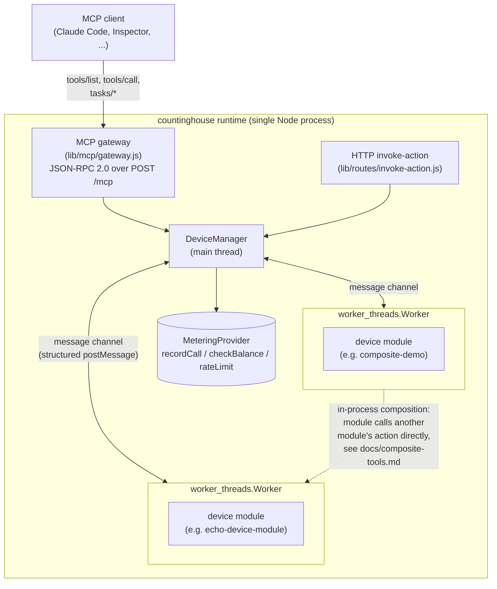

# countinghouse

**countinghouse hosts your MCP tools, meters every call, and lets tools
call each other in-process — so you can charge for what agents actually
use.**

It's a multi-tenant runtime for MCP: load Node.js "device modules" as
isolated tools, expose them over a stateless Streamable HTTP MCP gateway,
and get per-call metering, per-key rate limiting, and in-process tool
composition without hand-rolling any of it.

## 30-second quickstart

Requires Node.js >= 20, and a Redis instance reachable at
`redis://127.0.0.1:6379` (used for metering, rate limiting, and session
state — see `--redisUrl` to point elsewhere). **No other external
service is required** — authentication is file-backed by default (see
[Authentication](#authentication) below), not a database you have to
stand up first.

```sh
git clone https://github.com/mchen6/countinghouse.git
cd countinghouse
npm install

# start the runtime, loading the bundled echo demo module
node ./framework.js --workerThread --bindAddr 127.0.0.1 --loadModule ./pre-installed-packages/echo-device-module
# -> countinghouse listen on: 127.0.0.1:9527
```

No `auth.json` yet? The first run generates one (at
`<repo-root>/auth.json` by default — see `--authConfigPath`) with a demo
API key and prints it once, right at startup:

```
============================================================
countinghouse: no /path/to/countinghouse/auth.json found.
Generated a demo API key with access to every device --
replace it before any real deployment:

  X-CH-Key: demo-a1b2c3d4e5f6...

Edit /path/to/countinghouse/auth.json to add real keys, or set
COUNTINGHOUSE_API_KEY for single-key mode instead.
============================================================
```

Point an MCP client at it, passing that key as a header:

```sh
claude mcp add --transport http countinghouse http://127.0.0.1:9527/mcp \
  --header "X-CH-Key: demo-a1b2c3d4e5f6..."
```

Then, in a Claude Code session, just ask it to call the tool — e.g.
"use the countinghouse echo tool to echo back 'hello'". `tools/list`
exposes one tool per device module action (`echo_device_echoservice_echo`
in this case), each with a JSON Schema 2020-12 `inputSchema`/`outputSchema`
derived straight from the module's own spec — and, since `tools/list` is
filtered per apiKey, only the tools for devices that key actually has
access to (the demo key has access to every device).

Want to see tool composition and per-hop billing in one call? Load
`./pre-installed-packages/transform-demo` and `./pre-installed-packages/composite-demo`
alongside the echo module (repeat `--loadModule` once per module) and
call `composite_demo_compositeservice_run` — see
[`docs/composite-tools.md`](docs/composite-tools.md).

## Authentication

Every request carries an API key (`X-CH-Key` header for HTTP/MCP), and
`AuthProvider` decides which devices that key can see and call —
pluggable, `--authProvider file|sqlite|couchdb`:

- **`file` (default)** — a flat JSON file (`auth.json` by default,
  `--authConfigPath` to point elsewhere):
  ```json
  {
    "your-api-key": {"userName": "you", "devices": ["*"]}
  }
  ```
  `devices` may list specific deviceIDs, or `"*"` for every device.
  No file yet → a demo key is generated and printed once, as shown above.
  For deployments where writing a file is friction (e.g. a container),
  set `COUNTINGHOUSE_API_KEY=<key>` instead — that key gets wildcard
  access without needing `auth.json` at all.
- **`sqlite`** — a local `auth.sqlite3` file, managed with
  `node bin/countinghouse-auth-sqlite.js add-user/grant/revoke/list`
  (`--dbPath` to point elsewhere). No external service, just a db file
  instead of a JSON file — useful once you have more keys than are
  comfortable to hand-edit.
- **`couchdb`** — for an existing CouchDB-backed deployment. Needs the
  optional `nano` package (`npm install nano`, not installed by default)
  and a real CouchDB instance; `node lib/couchdb-adapter/init-db.js
  --dbUrl <url>` sets up the required design document on a fresh
  instance.

`--debug` (used in the framework's own test suite) bypasses `AuthProvider`
entirely — every apiKey is accepted, useful for local iteration, not for
anything reachable beyond localhost. See
[`docs/security-model.md`](docs/security-model.md) for the full picture,
including why an auto-generated demo key should never survive into a real
deployment.

## Architecture



Each device module runs in its own `worker_threads.Worker` — an
independent V8 heap, reachable only through a structured message-passing
protocol, not shared memory (see
[`docs/security-model.md`](docs/security-model.md) for exactly what that
isolation does and doesn't provide). Modules can call each other's
actions over the same message channel the runtime already uses to route
every action call, letting one MCP `tools/call` fan out into several
metered inner hops without any of the intermediate data leaving the
process or entering a model's context window.

## Origin

countinghouse's module/action/JSON-Schema model — device modules exposing
services, each with actions, discovered and invoked through a uniform
interface — is not new. It's a direct descendant of **CDIF (Common Device
Interconnect Framework)**, a UPnP-inspired IoT/web-service integration
layer first built in 2015, years before MCP existed. Two unrelated
problems — "describe and invoke heterogeneous smart-home devices
uniformly" and "describe and invoke heterogeneous AI agent tools
uniformly" — converged on strikingly similar shapes: a discovery/
description document, a JSON-Schema-typed call/response contract, and a
uniform invocation endpoint. countinghouse is CDIF's codebase and design
carried forward, rebranded and refit for that second problem, with MCP's
Streamable HTTP as the transport instead of a bespoke REST API.

## Security model

Device modules run with real OS-user privileges, isolated only at the
`worker_threads` level (independent heap, message-passing boundary) —
not sandboxed against arbitrary code execution. Read
[`docs/security-model.md`](docs/security-model.md) for the full threat
model: what worker isolation actually provides, what it explicitly does
not, and how that shapes the trust assumptions around third-party device
modules.

## License

Apache-2.0.
