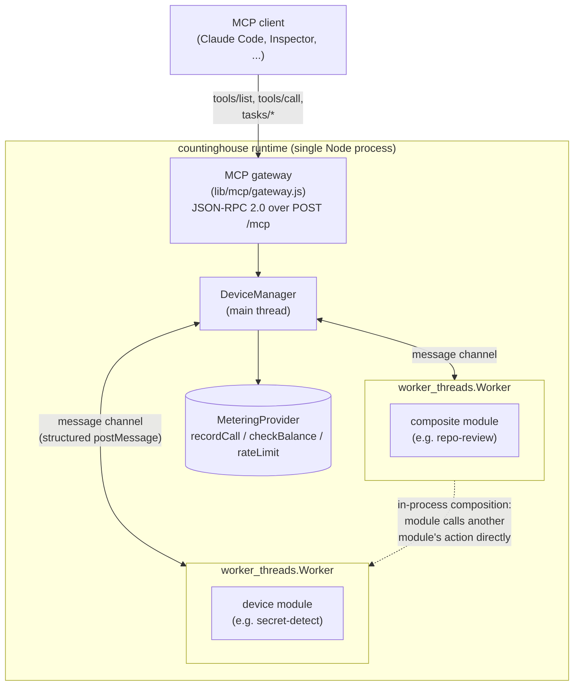

# countinghouse

**MCP has no story for tools calling other tools. countinghouse is a runtime
where they can — in-process, as one published, versioned, schema-checked
tool.**

Load Node.js modules as MCP tools, and let them call each other inside the
server process. The chain is published as a single tool with a single
schema, so what passes between the hops never crosses the MCP boundary and
never enters a model's context window. Multi-tenant auth, optional per-call
metering, rate limiting and the Tasks extension come with the runtime.

## Why this is a primitive, not a feature

MCP's shape is client-calls-tool, and that is the whole of it. When one tool
needs another, the orchestrating model is the only thing that can join them:
tool A returns to the model, the model reads the result, the model passes it
to tool B. Every intermediate byte is billed, attended to, and retained.

Code execution — the model writing a script for a sandbox to run — answers
part of this, and deserves a fair hearing rather than a strawman. The
differences that matter are narrower than speed. Its glue is a script written
fresh each run, so its guarantee is behavioral where a published tool's is
structural. Its tool calls still cross process boundaries even when the model
doesn't. And if tool A needs B halfway through its own execution, A must split
into `A_part1` and `A_part2` — A's private intermediate state becomes a public
interface the script has to receive and hand back. Cohesive logic that belonged
inside one tool becomes three calls and glue regenerated on every run. Such a
composite cannot be published as a tool at all. It can only exist as a script.

The structural part is the one worth having. Point an agent at a repository
and ask it to find hardcoded credentials: the scan tool returns megabytes of
source into the context window, the model reads all of it, then hands it to
the secret detector. **To find out whether you had leaked a credential, you
sent the credential to a third party.** Written as a composite tool instead,
the source moves between worker threads and a few kilobytes of findings come
back — and the guarantee is not that the model behaved. Open the tool's output
schema: there is no field that can hold a source file. There is no shape for
it to travel in.

## See it

Needs Node.js >= 20 and a Redis reachable at `redis://127.0.0.1:6379`
(metering, rate limiting and session state; `--redisUrl` points elsewhere).
No other external service — authentication is file-backed by default.

```sh
# no Redis running? this is enough for local evaluation
docker run -d --name countinghouse-redis -p 6379:6379 redis:7

git clone https://github.com/mchen6/countinghouse.git
cd countinghouse && npm install

npm run demo:repo-review
```

That loads four modules: one composite tool that reads a repository, scans it
for credentials and audits its dependencies, plus the three inner tools it
calls. Point an MCP client at it:

```sh
claude mcp add --transport http countinghouse http://127.0.0.1:9527/mcp \
  --header "X-CH-Key: demo-key"
```

Then aim it at a repository you would not paste into a chat window, and watch
what does and doesn't come back. Measured on this repo: **4.59 MB of response
composed client-side versus 11.0 KB through the composite tool — 428× fewer
bytes**, all of the difference being source code that stayed inside the
process.

The demo reads `examples/repo-review/auth.json`, a file committed on purpose.
It grants `demo-key` the composite tool and nothing else: the three inner
tools are absent from that key's `tools/list`, and calling one directly is
refused — while the same call *through* `repo-review` works and bills
`demo-key` for all three hops. That is the encapsulation the composite exists
to demonstrate. It is a demo credential, usable only against a server you
started yourself on `127.0.0.1`; replace it before this is reachable from
anywhere else.

Full walkthrough, the honest comparison against code execution, and a recorded
round trip from Claude Code: [`examples/repo-review/`](https://github.com/mchen6/countinghouse/blob/master/examples/repo-review/README.md).
For the mechanism on a toy payload, [`docs/composite-tools.md`](https://github.com/mchen6/countinghouse/blob/master/docs/composite-tools.md).

Installing from npm instead of cloning gets you the runtime and the bundled
demo modules, without the repo's example directory:

```sh
npm install countinghouse
npx countinghouse --workerThread --bindAddr 127.0.0.1 \
  --loadModule ./node_modules/countinghouse/pre-installed-packages/echo-device-module
```

The first run generates `auth.json` with a demo API key and prints it once at
startup. It grants wildcard access to every device with no expiry — replace it
before any real deployment. See [`docs/authentication.md`](https://github.com/mchen6/countinghouse/blob/master/docs/authentication.md).

## Writing one

A module is a directory — `package.json`, `api.json` (names, descriptions,
schema pointers), `schema.json` (JSON Schema 2020-12), and one handler file
per action. A handler is a function of `(input, ctx)`:

```js
// handlers/greetService/hello.js
module.exports = async (input, ctx) => ({
  output: {text: `hello ${input.name}`}
});
```

`input` is already validated against the schema. `ctx` carries the
authenticated caller, this device's identity, a logger, and
`ctx.serviceClient` — which is how a module calls another module:

```js
module.exports = async (input, ctx) => {
  // clientFor/invoke are thin promise wrappers around ctx.serviceClient and
  // client.invoke; `as` is the identity each hop is authorized with.
  const scan   = await clientFor(ctx, SCAN_DEVICE_ID,   SCAN_SERVICE);
  const detect = await clientFor(ctx, DETECT_DEVICE_ID, DETECT_SERVICE);

  const files   = await invoke(scan,   'scan',   {root: input.root}); // megabytes, in-process
  const secrets = await invoke(detect, 'detect', {files});            // never leaves the process

  return {output: {findings: secrets.findings}};                      // kilobytes, to the client
};
```

Each inner hop is *authorized* as a fixed internal identity (via `as`) and
*billed* to the outer caller — the split that lets a composite expose one
tool while the tools underneath it stay private. Full reference:
[`docs/module-development.md`](https://github.com/mchen6/countinghouse/blob/master/docs/module-development.md).
Migrating a 5.x module is one command: `npx countinghouse-migrate-module ./my-module`
(4.x specs need `npx countinghouse-migrate-spec` first — see
[`MIGRATION.md`](https://github.com/mchen6/countinghouse/blob/master/MIGRATION.md)).

Developing on countinghouse itself: run `git config core.hooksPath .githooks`
after cloning, since git does not clone hooks. The pre-commit hook runs lint
and the golden `tools/list` check (~10s), so no commit can move the MCP surface
without saying so. CI enforces the same thing.

## What else the runtime gives you

| | |
|---|---|
| **Per-module isolation** | Each module runs in its own `worker_threads.Worker` — independent V8 heap, message-passing boundary. Read the [threat model](https://github.com/mchen6/countinghouse/blob/master/docs/security-model.md) before assuming more than that. |
| **Multi-tenant auth** | Every request carries an API key; `AuthProvider` decides which devices it can see and call, and `tools/list` is filtered per key. Backends: `file` (default, zero-config), `sqlite`, `couchdb`. |
| **Optional metering** | `MeteringProvider` records every call and every inner hop, with platform metering as the sole billing authority so composed calls cannot double-charge. Off by default — `--mcpToolCallCost` is `0` until you set it. |
| **Tasks** | The MCP 2026-07-28 Tasks extension (`tasks/get`/`result`/`list`/`cancel`), over a job engine that predates it. |
| **Rate limiting** | Per-API-key and global calls/second caps. |
| **Stateless transport** | Streamable HTTP only. Legacy HTTP+SSE is deliberately not implemented. |

Flags and endpoints: [`docs/cli-and-api-reference.md`](https://github.com/mchen6/countinghouse/blob/master/docs/cli-and-api-reference.md).
Which guarantee applies on which entry path: [`docs/cross-cutting-matrix.md`](https://github.com/mchen6/countinghouse/blob/master/docs/cross-cutting-matrix.md).

## Architecture



Modules call each other over the same message channel the runtime already uses
to route every action call, so one `tools/call` fans out into several metered
inner hops without intermediate data leaving the process. With
`--directPeerChannels` those hops go worker-to-worker directly, skipping the
main thread — see [`docs/direct-peer-channels.md`](https://github.com/mchen6/countinghouse/blob/master/docs/direct-peer-channels.md).
The rationale behind this and other architecture decisions is collected in
[`docs/design-decisions.md`](https://github.com/mchen6/countinghouse/blob/master/docs/design-decisions.md).

**On performance, honestly.** In-process hops are cheaper than crossing a
process boundary — at 1MB payloads, one hop costs 9.1ms in-process against
86.1ms over stdio and 38.8ms over HTTP. But the largest per-hop saving
measured is 31ms, so any tool whose own work takes more than ~310ms sees even
that as under 10% of the call. Per call, transport rounds to nothing. What
does not round away is the CPU across a session: a hundred such hops cost 21
seconds of CPU in-process against 173 over stdio. That is capacity, not
latency. [Tables, methodology and caveats](https://github.com/mchen6/countinghouse/blob/master/docs/direct-peer-channels.md#benchmark-transport-overhead-vs-other-tool-to-tool-mechanisms).

## Status, and what isn't built

In-process composition works only between modules on the same runtime. Modules
must be written to this runtime's format — though not by hand: start with
`--authoringTools` and a coding agent can design, validate, load and call a
module for you, using the four authoring tools and the skill this repo ships at
`.claude/skills/countinghouse-module/`. `npx countinghouse-validate ./my-module`
is the same check from a shell — see [`docs/module-authoring.md`](https://github.com/mchen6/countinghouse/blob/master/docs/module-authoring.md). An importer for servers built on the official
MCP TypeScript SDK is planned and does not exist yet.

Module isolation is `worker_threads`: separate V8 heap, shared OS process,
filesystem, network and `process` global. That is a reasonable boundary for
modules from developers you have a relationship with, and it is **not**
comparable to containers, gVisor or micro-VMs. `docs/security-model.md` states
plainly what it does and does not provide, and what would be required to go
further.

## Origin

countinghouse is the codebase of **CDIF** (Common Device Interconnect
Framework), a UPnP-inspired IoT and web-service integration layer first built
in 2015, carried forward and refit for MCP. Two unrelated problems — describing
and invoking heterogeneous devices, and describing and invoking heterogeneous
agent tools — converged on nearly the same shape: a discovery document, a
JSON-Schema-typed call contract, a uniform invocation endpoint. The story, and
what a decade of production actually bought, is in
[`docs/index.md`](https://github.com/mchen6/countinghouse/blob/master/docs/index.md).
The original repo is archived at [mchen6/cdif](https://github.com/mchen6/cdif)
with history intact.

## License

Apache-2.0.
