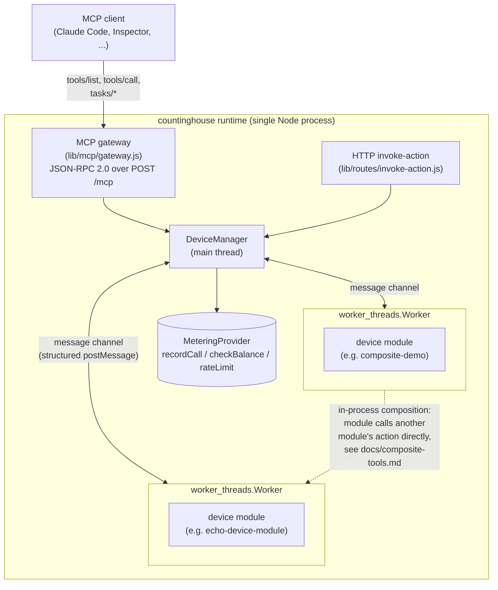

# countinghouse

**countinghouse hosts your MCP tools, meters every call, and lets tools
call each other in-process — so you can charge for what agents actually
use.**

It's a multi-tenant runtime for MCP: load Node.js "device modules" as
isolated tools, expose them over a stateless Streamable HTTP MCP gateway,
and get per-call metering, per-key rate limiting, and in-process tool
composition without hand-rolling any of it.

## 30-second quickstart

Requires Node.js >= 20, and a Redis instance reachable at
`redis://127.0.0.1:6379` (used for metering, rate limiting, and session
state — see `--redisUrl` to point elsewhere). **No other external
service is required** — authentication is file-backed by default (see
[Authentication](#authentication) below), not a database you have to
stand up first.

```sh
# don't have Redis running already? this is enough for local evaluation
docker run -d --name countinghouse-redis -p 6379:6379 redis:7

git clone https://github.com/mchen6/countinghouse.git
cd countinghouse
npm install

# start the runtime, loading the bundled echo demo module
node ./framework.js --workerThread --bindAddr 127.0.0.1 --loadModule ./pre-installed-packages/echo-device-module
# -> countinghouse listen on: 127.0.0.1:9527
```

No `auth.json` yet? The first run generates one (at
`<repo-root>/auth.json` by default — see `--authConfigPath`) with a demo
API key and prints it once, right at startup:

```
============================================================
countinghouse: no /path/to/countinghouse/auth.json found.
Generated a demo API key with access to every device --
replace it before any real deployment:

  X-CH-Key: demo-a1b2c3d4e5f6...

Edit /path/to/countinghouse/auth.json to add real keys, or set
COUNTINGHOUSE_API_KEY for single-key mode instead.
============================================================
```

Point an MCP client at it, passing that key as a header:

```sh
claude mcp add --transport http countinghouse http://127.0.0.1:9527/mcp \
  --header "X-CH-Key: demo-a1b2c3d4e5f6..."
```

Then, in a Claude Code session, just ask it to call the tool — e.g.
"use the countinghouse echo tool to echo back 'hello'". `tools/list`
exposes one tool per device module action (`echo_device_echoservice_echo`
in this case), each with a JSON Schema 2020-12 `inputSchema`/`outputSchema`
derived straight from the module's own spec — and, since `tools/list` is
filtered per apiKey, only the tools for devices that key actually has
access to (the demo key has access to every device).

Want to see tool composition and per-hop billing in one call? See the
[Composite demo walkthrough](#composite-demo-walkthrough) below.

## Authentication

Every request carries an API key (`X-CH-Key` header for HTTP/MCP), and
`AuthProvider` decides which devices that key can see and call —
pluggable via `--authProvider file|sqlite|couchdb`. `file` (the default
shown above) needs nothing beyond a JSON file and is what the quickstart
uses; `sqlite` trades the hand-edited file for a real db once you have
more keys than are comfortable to manage by hand; `couchdb` is for
plugging into a CouchDB-backed deployment you already operate, and is the
only one of the three that needs an external service. `--debug` (used by
this repo's own test suite) bypasses `AuthProvider` entirely — useful for
local iteration, not for anything reachable beyond localhost. **The
auto-generated demo key shown above grants wildcard access to every
device with no expiry — replace it before any real deployment.** Full
reference, including `auth.json`'s format and CouchDB setup:
[`docs/authentication.md`](docs/authentication.md).

## Composite demo walkthrough

Beyond a single tool call, `composite-demo` shows one MCP `tools/call`
fanning out into two in-process, metered inner hops: it calls
`transform-demo`, then feeds that result into `echo-device-module` — with
the resulting bill attached to the response instead of hidden in
server-side logs. `--mcpToolCallCost` defaults to `0` (nothing is charged
unless you opt in), so set it to something non-zero to actually see the
bill move:

```sh
node ./framework.js --workerThread --bindAddr 127.0.0.1 --mcpToolCallCost 1 \
  --loadModule ./pre-installed-packages/echo-device-module \
  --loadModule ./pre-installed-packages/transform-demo \
  --loadModule ./pre-installed-packages/composite-demo

curl -s -X POST http://127.0.0.1:9527/mcp -H "Content-Type: application/json" \
  -H "X-CH-Key: <your key>" -d '{"jsonrpc":"2.0","id":1,"method":"tools/call","params":{
        "name":"composite_demo_compositeservice_run",
        "arguments":{"text":"hello from the composite demo"}}}'
```

```json
{
  "finalText": "HELLO FROM THE COMPOSITE DEMO",
  "bill": [
    {"hop": 1, "tool": "transform-demo/uppercase", "charged": 1, "balance": -1},
    {"hop": 2, "tool": "echo-device-module/echo", "charged": 1, "balance": -2}
  ]
}
```

`finalText` is `transform-demo` uppercasing the input, then
`echo-device-module` echoing that result back — two independent modules,
called one after another entirely inside the server process, with neither
intermediate result ever entering this MCP client's context. `bill` is
one entry per inner hop: which tool ran, what it cost, and the running
balance afterward for `composite-demo`'s own internal identity (not the
caller's apiKey — see [`docs/composite-tools.md`](docs/composite-tools.md)'s
known simplifications for why) — proof that per-hop metering isn't
skipped just because the calls happen module-to-module instead of
client-to-server. A fresh identity starts at balance `0`; each hop
subtracts its cost, so balance going more negative over successive calls
is expected, not an error. Full mechanism and the billing-authority
guarantee behind it: [`docs/composite-tools.md`](docs/composite-tools.md).

## CLI flags reference

The flags most operators need. `lib/cli-options.js` has the complete set,
including less commonly used ones (module verification, API caching,
WebSocket/socket.io event delivery, OpenStack API simulation).

| Flag | Default | Purpose |
|---|---|---|
| `--workerThread` | off | Run each device module in its own `worker_threads.Worker` — the isolation this project is built around. Recommended for anything beyond a quick local test. |
| `--bindAddr` | all interfaces | Address to bind the HTTP server to. |
| `--port` | `9527` | HTTP port. |
| `--loadModule <path>` | — | Load a local device module at startup; repeat for multiple modules. |
| `--redisUrl` | `redis://127.0.0.1:6379` | Redis instance for metering, rate limiting, and session state. |
| `--authProvider file\|sqlite\|couchdb` | `file` | AuthProvider backend — see [Authentication](#authentication). |
| `--authConfigPath <path>` | backend-specific | Config file/db path for the selected AuthProvider backend. |
| `--debug` | off | Bypass AuthProvider entirely; every apiKey accepted. Local iteration only. |
| `--directPeerChannels` | off | Route worker-to-worker calls directly instead of through the main thread — see [`docs/direct-peer-channels.md`](docs/direct-peer-channels.md). |
| `--directPeerChannelsMaxConcurrency` | `16` | Backpressure cap (in-flight calls per channel) for the direct-peer-channels path. |
| `--mcpToolCallCost <n>` | `0` | Cost recorded via `MeteringProvider.recordCall` for every MCP `tools/call`. |
| `--apiKeyRateLimit <n>` | unlimited | Per-apiKey calls/second cap. |
| `--globalRateLimit <n>` | unlimited | Combined calls/second cap across every caller. |
| `--requestTimeout <seconds>` | `30` | Per-call timeout before a device is considered unresponsive. |
| `--deviceConfigPath <path>` | `./config/devices` | Directory of per-module device config files (one `<moduleName>.json` each). |
| `--locale <locale>` | `en-US` | Error message locale (`zh-CN` also available). |

## HTTP API surface

| Endpoint | Protocol | Purpose |
|---|---|---|
| `POST /mcp` | MCP (JSON-RPC 2.0, stateless Streamable HTTP) | `initialize`, `tools/list`, `tools/call`, and the Tasks extension (`tasks/get`/`tasks/result`/`tasks/list`/`tasks/cancel`) — the primary interface. |
| `GET /balance` | Platform | Current balance for the caller's apiKey (`MeteringProvider.checkBalance`). |
| `GET /device-list` | Platform | Devices the caller's apiKey can see — same filtering `tools/list` applies. |
| `POST /devices/:deviceID/invoke-action` | Platform, pre-MCP HTTP API | Direct HTTP equivalent of `tools/call`; predates the MCP gateway and still works. |
| `GET /devices/:deviceID/get-spec`, `.../schema` | Platform | A device's `api.json` / resolved JSON Schema 2020-12 documents. |
| `POST /devices/:deviceID/{add,get,remove}-job`, `get-job-history` | Platform | Job control predating the MCP Tasks extension; still available for non-MCP callers. |
| `POST /load-module`, `/unload-module`, `/restart-module` | Platform, `--debug` only | Module lifecycle management. |
| `POST /verify-module`, `/reload-module`, `/shutdown`, `GET /get-module-device-list` | Platform, `--debug` or `--verifyModule` | Operational/admin surface, not meant to be reachable by end users. |

Every device-scoped route above (everything under `/devices/:deviceID/...`)
goes through the same `AuthProvider` check `tools/call` does.

## Module development

A device module is a directory with:

```
my-module/
├── package.json   # name, version — a normal npm package
├── api.json        # device/service/action metadata (see below)
├── schema.json       # JSON Schema 2020-12 input/output/fault per action
└── device.js           # wires api.json + schema.json + action handlers together
```

`api.json` declares one `friendlyName`, one or more services (each a
`urn:...:serviceID:...`), and each service's actions — a name, a
human-readable `description` (required; it's what an LLM sees as the MCP
tool's description) and an `argumentList` pointing at named entries in
`schema.json`. `schema.json` supplies the actual JSON Schema 2020-12
`input`/`output`/`fault` shapes those names refer to — this is what
becomes each MCP tool's `inputSchema`/`outputSchema`. `device.js` loads
one handler function per action (via `CHUtil.loadFile`) and registers it
with `this.setAction(serviceID, actionName, handlerFn)` — the bundled
modules keep one handler per file, named `com-<namespace>-<service>-<action>.js`,
but that's a convention `device.js` chooses, not something the framework
requires. Handlers are plain Node functions, callback-style
(`function(args, callback)`) or `async`, that return `{output: {...}}` or
call back with an error.

The bundled `pre-installed-packages/` modules are worked examples at
different complexity levels: `echo-device-module` for the full pattern
including error/fault handling, `transform-demo` for close to the
smallest module that's still useful, and `composite-demo` for a module
that calls other modules.

## Performance

Cross-worker call performance — main-thread-routed (default) vs. the
opt-in `--directPeerChannels` path — is benchmarked against the current
Node target, not carried over from this codebase's earlier architecture.
See [`docs/direct-peer-channels.md`](docs/direct-peer-channels.md) for
the numbers and methodology.

## Architecture



Each device module runs in its own `worker_threads.Worker` — an
independent V8 heap, reachable only through a structured message-passing
protocol, not shared memory (see
[`docs/security-model.md`](docs/security-model.md) for exactly what that
isolation does and doesn't provide). Modules can call each other's
actions over the same message channel the runtime already uses to route
every action call, letting one MCP `tools/call` fan out into several
metered inner hops without any of the intermediate data leaving the
process or entering a model's context window.

## Origin

countinghouse's module/action/JSON-Schema model — device modules exposing
services, each with actions, discovered and invoked through a uniform
interface — is not new. It's a direct descendant of **CDIF (Common Device
Interconnect Framework)**, a UPnP-inspired IoT/web-service integration
layer first built in 2015, years before MCP existed. Two unrelated
problems — "describe and invoke heterogeneous smart-home devices
uniformly" and "describe and invoke heterogeneous AI agent tools
uniformly" — converged on strikingly similar shapes: a discovery/
description document, a JSON-Schema-typed call/response contract, and a
uniform invocation endpoint. countinghouse is CDIF's codebase and design
carried forward, rebranded and refit for that second problem, with MCP's
Streamable HTTP as the transport instead of a bespoke REST API.

## Security model

Device modules run with real OS-user privileges, isolated only at the
`worker_threads` level (independent heap, message-passing boundary) —
not sandboxed against arbitrary code execution. Read
[`docs/security-model.md`](docs/security-model.md) for the full threat
model: what worker isolation actually provides, what it explicitly does
not, and how that shapes the trust assumptions around third-party device
modules.

## License

Apache-2.0.
